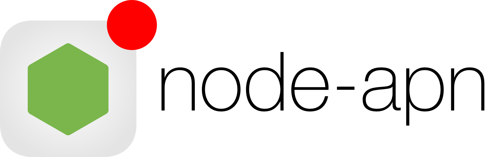

[<p align="center"></p>][node-apn]

node-apn
========

> A Node.js module for interfacing with the Apple Push Notification service.

[](https://github.com/node-apn/node-apn/issues/436)
[![Build status][ci-image] ][ci-url]
[![Code coverage][coverage-image]][coverage-url]
[![Codacy][codacy-image]][codacy-url]
[![dependencies][dependencies-image]][dependencies-url]
[![devdependencies][devdependencies-image]][devdependencies-url]

[logo]:doc/logo.png
[npm-image]:https://nodei.co/npm/apn.png?downloads=true
[npm-url]:https://npmjs.com/package/apn
[ci-image]:https://api.travis-ci.org/node-apn/node-apn.svg
[ci-url]:https://travis-ci.org/node-apn/node-apn
[coverage-image]:https://coveralls.io/repos/argon/node-apn/badge.svg?branch=develop
[coverage-url]:https://coveralls.io/r/argon/node-apn
[codacy-image]:https://www.codacy.com/project/badge/e7735fbe0db244f3b310657d0dabaa11
[codacy-url]:https://www.codacy.com/public/argon/node-apn

[dependencies-image]:https://david-dm.org/node-apn/node-apn/status.svg
[dependencies-url]:https://david-dm.org/node-apn/node-apn
[devdependencies-image]:https://david-dm.org/node-apn/node-apn/dev-status.svg
[devdependencies-url]:https://david-dm.org/node-apn/node-apn?type=dev

## Features

- Based on HTTP/2 based provider API
- Maintains a connection to the server to maximise notification batching and throughput.
- Automatically resends unsent notifications if an error occurs

## Installation

[npm][] is the preferred installation method:

```bash
$ npm install apn --save
```

## Quick Start

This readme is a brief introduction, please refer to the full [documentation](doc/apn.markdown) in `doc/` for more details.

If you have previously used v1.x and wish to learn more about what's changed in v2.0, please see [What's New](doc/whats-new.markdown)

### Load in the module

```javascript
var apn = require('apn');
```

### Connecting
Create a new connection to the Apple Push Notification provider API, passing a dictionary of options to the constructor. You must supply your token credentials in the options.

```javascript
var options = {
  token: {
    key: "path/to/APNsAuthKey_XXXXXXXXXX.p8",
    keyId: "key-id",
    teamId: "developer-team-id"
  },
  production: false
};

var apnProvider = new apn.Provider(options);
```

By default, the provider will connect to the sandbox unless the environment variable `NODE_ENV=production` is set.

For more information about configuration options consult the [provider documentation](doc/provider.markdown).

Help with preparing the key and certificate files for connection can be found in the [wiki][certificateWiki]

#### Connecting through an HTTP proxy

If you need to connect through an HTTP proxy, you simply need to provide the `proxy: {host, port}` option when creating the provider. For example:

```javascript
var options = {
  token: {
    key: "path/to/APNsAuthKey_XXXXXXXXXX.p8",
    keyId: "key-id",
    teamId: "developer-team-id"
  },
  proxy: {
    host: "192.168.10.92",
    port: 8080
  }
  production: false
};

var apnProvider = new apn.Provider(options);
```

The provider will first send an HTTP CONNECT request to the specified proxy in order to establish an HTTP tunnel. Once established, it will create a new secure connection to the Apple Push Notification provider API through the tunnel.

### Sending a notification
To send a notification you will first need a device token from your app as a string

```javascript
let deviceToken = "a9d0ed10e9cfd022a61cb08753f49c5a0b0dfb383697bf9f9d750a1003da19c7"
```

Create a notification object, configuring it with the relevant parameters (See the [notification documentation](doc/notification.markdown) for more details.)

```javascript
var note = new apn.Notification();

note.expiry = Math.floor(Date.now() / 1000) + 3600; // Expires 1 hour from now.
note.badge = 3;
note.sound = "ping.aiff";
note.alert = "\uD83D\uDCE7 \u2709 You have a new message";
note.payload = {'messageFrom': 'John Appleseed'};
note.topic = "<your-app-bundle-id>";
```

Send the notification to the API with `send`, which returns a promise.

```javascript
apnProvider.send(note, deviceToken).then( (result) => {
  // see documentation for an explanation of result
});
```

This will result in the the following notification payload being sent to the device

```json
{"messageFrom":"John Appelseed","aps":{"badge":3,"sound":"ping.aiff","alert":"\uD83D\uDCE7 \u2709 You have a new message"}}
```

You should only create one `Provider` per-process for each certificate/key pair you have. You do not need to create a new `Provider` for each notification. If you are only sending notifications to one app then there is no need for more than one `Provider`. 

If you are constantly creating `Provider` instances in your app, make sure to call `Provider.shutdown()` when you are done with each provider to release its resources and memory.

## Troubleshooting

You are encouraged to read the extremely informative [Troubleshooting Push Notifications][tn2265] Tech Note in the first instance, in case your query is answered there.

## Support

If you have any questions or difficulties working with the module, the [node-apn Google group][googlegroup] should be your first port of call.

Please include as much detail as possible - especially debug logs. If the problem is reproducible, sample code is also extremely helpful. GitHub Issues should only be created for verified problems and enhancements, this will allow them to be tracked more easily.

## Resources

* [Local and Push Notification Programming Guide: APNs Overview][pl]
* [Apple Technical Note: Troubleshooting Push Notifications][tn2265]
* [List of Projects, Applications and Companies Using Node-apn][pacapn]

## Credits

Created by [Andrew Naylor][argon]

Thanks to: [Ian Babrou][bobrik], [dgthistle][dgthistle], [Keith Larsen][keithnlarsen], [Mike P][mypark], [Greg Bergé][neoziro], [Asad ur Rehman][AsadR], [Nebojsa Sabovic][nsabovic], [Alberto Gimeno][gimenete], [Randall Tombaugh][rwtombaugh], [Michael Stewart][thegreatmichael], [Olivier Louvignes][mgcrea], [porsager][porsager], [Craig Hockenberry][chockenberry]

## License

Released under the MIT License

> Copyright (c) 2013 Andrew Naylor
>
> Permission is hereby granted, free of charge, to any person obtaining a copy
> of this software and associated documentation files (the "Software"), to deal
> in the Software without restriction, including without limitation the rights
> to use, copy, modify, merge, publish, distribute, sublicense, and/or sell
> copies of the Software, and to permit persons to whom the Software is
> furnished to do so, subject to the following conditions:
>
> The above copyright notice and this permission notice shall be included in
> all copies or substantial portions of the Software.
>
> THE SOFTWARE IS PROVIDED "AS IS", WITHOUT WARRANTY OF ANY KIND, EXPRESS OR IMPLIED, INCLUDING BUT NOT LIMITED TO THE WARRANTIES OF MERCHANTABILITY, FITNESS FOR A PARTICULAR PURPOSE AND NONINFRINGEMENT. IN NO EVENT SHALL THE AUTHORS OR COPYRIGHT HOLDERS BE LIABLE FOR ANY CLAIM, DAMAGES OR OTHER LIABILITY, WHETHER IN AN ACTION OF CONTRACT, TORT OR OTHERWISE, ARISING FROM, OUT OF OR IN CONNECTION WITH THE SOFTWARE OR THE USE OR OTHER DEALINGS IN THE SOFTWARE.

[npm]: https://npmjs.org
[node-apn]: https://github.com/node-apn/node-apn
[certificateWiki]:https://github.com/node-apn/node-apn/wiki/Preparing-Certificates "Preparing Certificates"
[pl]: https://developer.apple.com/library/content/documentation/NetworkingInternet/Conceptual/RemoteNotificationsPG/APNSOverview.html "Local and Push Notification Programming Guide: APNs Overview"
[tn2265]: http://developer.apple.com/library/ios/#technotes/tn2265/_index.html "Troubleshooting Push Notifications"
[googlegroup]:https://groups.google.com/group/node-apn "node-apn Google Group"
[pacapn]:https://github.com/node-apn/node-apn/wiki/Projects,-Applications,-and-Companies-Using-Node-apn "List of Projects, Applications and Companies Using node-apn"
[argon]: https://github.com/argon
[bobrik]: https://github.com/bobrik
[dgthistle]: https://github.com/dgthistle
[keithnlarsen]: https://github.com/keithnlarsen
[mypark]: https://github.com/mypark
[neoziro]: https://github.com/neoziro
[AsadR]: https://github.com/AsadR
[nsabovic]: https://github.com/nsabovic
[gimenete]: https://github.com/gimenete
[rwtombaugh]: https://github.com/rwtombaugh
[thegreatmichael]: https://github.com/thegreatmichael
[mgcrea]: https://github.com/mgcrea
[porsager]: https://github.com/porsager
[chockenberry]: https://github.com/chockenberry

